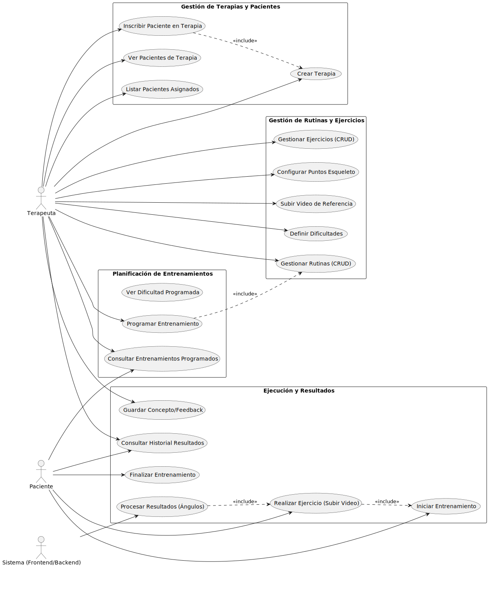

# Telerehabilitación API

Esta API es el backend para una plataforma de telerehabilitación física. Permite a los terapeutas gestionar pacientes,
crear rutinas de ejercicios personalizadas y realizar un seguimiento del progreso mediante el análisis de video. Los
pacientes pueden consultar sus entrenamientos programados, realizar ejercicios y recibir retroalimentación automática
sobre su ejecución.

Análisis del Repositorio:

* > <a href="https://gitingest.com/santivarelaagent-cmd/telerehabilitacion_be" target="_blank">GIT INGEST</a>

Documentación a profundidad:

* > <a href="https://deepwiki.com/santivarelaagent-cmd/telerehabilitacion_be" target="_blank">DEEP WIKI</a>

## Arquitectura


## Casos de uso



## Esquema DB

* > <a href="https://raw.githubusercontent.com/santivarelaagent-cmd/telerehabilitacion_be/main/ER.svg" target="_blank">Diagrama ER</a>


## ESQUELETO MEDIAPIPE


* > [LIBRO PY](https://aprendepython.es/core/introduction/)

## Dependecias

```code
asgiref
certifi
chardet
coreapi
coreschema
Django
django-cors-headers
django-environ
djangorestframework
drf-yasg
gevent
grequests
gunicorn
idna
inflection
itypes
Jinja2
MarkupSafe
openapi-codec
packaging
psycopg2
pyparsing
pytz
requests
ruamel.yaml
ruamel.yaml.clib
simplejson
six
sqlparse
uritemplate
urllib3
zope.event
zope.interface
```

