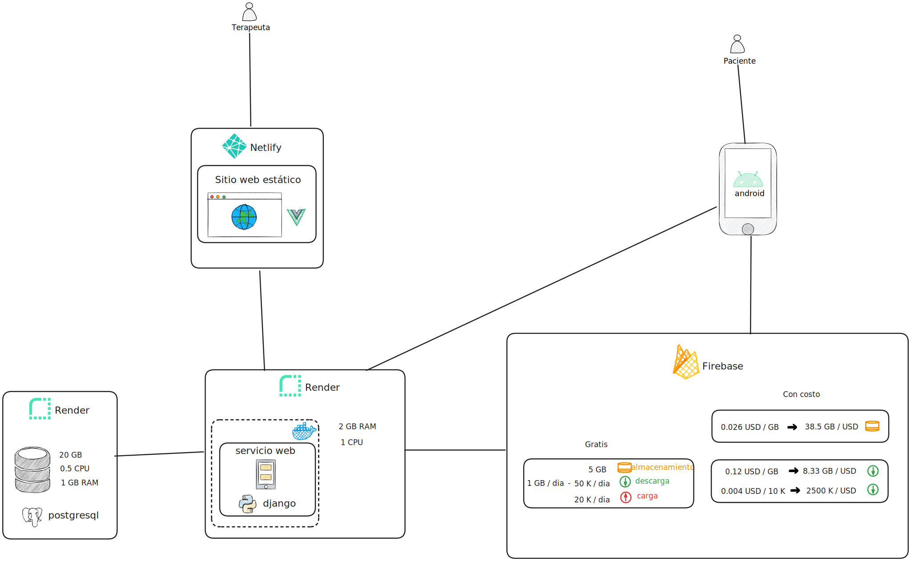

# Telerehabilitación API


## Arquitectura



## Esquema DB

* > [Diagrama ER](https://drive.google.com/file/d/11CthVkQSIoFV-ixqy66K8xz2x26dKVao/view?usp=sharing) 

* > [LIBRO PY](https://aprendepython.es/core/introduction/)


## Dependecias

```code
asgiref
certifi
chardet
coreapi
coreschema
Django
django-cors-headers
django-environ
djangorestframework
drf-yasg
gevent
grequests
gunicorn
idna
inflection
itypes
Jinja2
MarkupSafe
openapi-codec
packaging
psycopg2
pyparsing
pytz
requests
ruamel.yaml
ruamel.yaml.clib
simplejson
six
sqlparse
uritemplate
urllib3
zope.event
zope.interface
```

